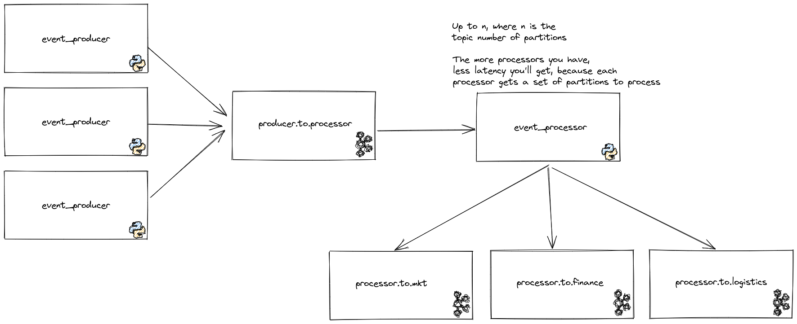

## Event Processor

An implementation of a challenge that requires a multi-tenant event processor.

## How do I run this thing?
There's information for every command by executing `make help`.
To run locally (without docker), do:

- `make local-setup`
- `make local-docker-compose-spinup`
- `make local-generate-classes-from-avro-schemas`
- `make local-register-schemas`

And run the application with the root of the project on PYTHONPATH, otherwise, you will get import errors.
Below, there's the parameters list that were used in a point of time while I was testing:

Producer:
```
-bootstrap_server localhost:9092 -schema_registry_url http://localhost:8081 -target_topic producer.to.processor -origin_service_type financial -origin_service_id 123456 -list_of_destinations FINANCE marketing -amount_of_messages 8 -sleep_between_messages_in_seconds 1 -log_level INFO
```

Consumer:
```
-log_level DEBUG -processor_id event-processor-1 -bootstrap_server localhost:9092 -schema_registry_url http://localhost:8081 -source_topic producer.to.processor -batch_size_to_commit_offsets 5 -destination_configurations "{\"FINANCE\": {\"output_topic\": \"processor.to.finance\", \"output_subject\": \"processor.to.consumer-value\"}, \"MARKETING\": {\"output_topic\": \"processor.to.marketing\", \"output_subject\": \"processor.to.consumer-value\"}, \"LOGISTICS\": {\"output_topic\": \"processor.to.logistics\", \"output_subject\": \"processor.to.consumer-value\"}}" -group_id event_processor
```

## Requirements
Unix environment (make), Docker (mine is 20.10.12) and docker-compose (mine is 1.28.5).

## Considerations

- At least once delivery.
- Kafka will be the persistence layer.
- All the code (except for the tests) is made to be read from top to bottom. Methods are ordered by its call order, as
  any code should be done, according to Robert C. Martin's
  [Clean Code](https://www.amazon.com.br/Clean-Code-Handbook-Software-Craftsmanship/dp/0132350882/ref=asc_df_0132350882/?tag=googleshopp00-20&linkCode=df0&hvadid=379787788238&hvpos=&hvnetw=g&hvrand=11862824861617951348&hvpone=&hvptwo=&hvqmt=&hvdev=c&hvdvcmdl=&hvlocint=&hvlocphy=9102225&hvtargid=pla-435472505264&psc=1).
- There's no code comments. If the code is not self explanatory, it should be refactored, with exception of APIs and 
libraries that are widely used. I made some explanation below about the offset commit logic because to make sure that
is clear, because it is a little bit complex because we are dealing with asynchronous processing.

## Technology Choices

- Python 3.9.2 just because I had it on my pyenv setup.
- Black as linter, because of its popularity. I had to go back a few versions in order to avoid dependency conflicts.
- landoop fast-data-dev docker image because it is an environment that I am used to play with in my studies.
- Kafka because it is a beautiful piece of technology, to be honest I struggled to don't go borderline and use
  [this guy](https://redpanda.com/). But since I have a strong background on Kafka, I chose it.
- Avro Data because it is an Industry standard and Kafka deals very well with it. Also, almost all clients have support
  and it is well optimized in terms of sizing.
- Schema registry because of its nice integration with Kafka.

## Description

Since the proposal was to have multi tenant input and a kind of fan out to multiple services, Kafka is a very good fit
for the solution. I've decided to use a single topic for input to the Event Processor, and multiple topics for output.



Having a single topic for input, I understood that it is kind of a requirement, although I strongly disagree if the
produced events have different schemas. I've simplified here and made a single schema for every `event_producer`, but
again, if the schemas were different, I would put in different topics.

The messages in this topic are keyed by an id of the producers plus the destination service type. If there is just a 
few combinations, it may be wise to change this key strategy, otherwise, we will end up having hot partitions in
the `producer.to.processor` topic.

All the topics in the solution have just 3 partitions, because I guess that evaluating the performance is not an issue
here. But if we were building a production app, there should be an evaluation on how many partitions each topic should
have since partitions define the throughput that the platform can reach.

The `event_processor` gets messages from the topic, resolving its schema and sends to the appropriate output topic. 
Schema Registry was used with AVRO since this combination is widely used in the industry and
have nice features such as Schema Evolution and low overhead on the payload, because it holds just the schema id. Also,
for the persistence layer, we've used Kafka itself. It is easy to add a long retention persistence component in this
architecture, it could be used a Sink Kafka Connect connector from Kafka to a blob storage (s3, Azure Blob Storage, GCS)
.

The output topics all have the same schema for simplicity reasons.

## About the Event Processor code

There's just one thing that I want to well described in docs about the code. Since we are consuming from a topic
and producing in an asynchronous way, the logic of committing got more complex than I expected. It works this way:

- Poll for a message on the consumer.
- Next, add it to an on flight queue of messages, which have messages that are being processed.
- Then, transform the message and send in an asynchronous way to the output topic. Since this step is asynchronous, 
a callback is registered.
- Next, when the callback is triggered, we get the message out of the on flight queue of messages and add 1 to processed
messages counter.
- Then update an internal structure with information about topic/partition/offset of everything that has been processed
so far.
- Finally, if the amount of messages processed is divisible by the amount of processed messages before committing 
offsets (a parameter), then we get the internal structure with topic/partition/offset information, put this in a list
structure of `TopicPartition` objects, adding 1 to offset because the logic of the offsets is the next message to be 
read, and send it to Kafka.

If the application breaks, this logic guarantees at least once delivery guarantees, because we only commit things that 
are already on kafka.

## Troubles

I had trouble composing a schema with two avro schemas. It seems that this was
[a thing](https://github.com/confluentinc/schema-registry/issues/1439) with the distro of the Confluent platform inside
the environment I was using, so I opted for a simpler schema structure.

Also, making the docker-compose turned out to be a hard task. I wanted to trigger a container startup on termination of
another one (`condition: service_completed_successfully`), but this is available only in a version of the docker-compose
that is not in apt or snap. Then, I chose to put a Sleep in the producers and consumers startup. I know this is bad, but
it is better than you having to set up a docker-compose version by hand.

## Improvements

The first thing is I would refactor the code and inject dependencies in both Producer and Consumer boilerplates
to avoid having to patch so many stuff in tests. When tests gets tricky to write, it indicates a problem in the
software architecture. I don't think that it is terrible (otherwise, I wouldn't submit for review), but I do think
that there's space for improvements.

Another thing that could be improved is the base docker images. I would use an Alpine or Slim distro installing stuff
that is required, but opted to simplify this and use a bigger, more complete, image to avoid headaches.

The other point of improvement that I see is that the event_processor could be replaced by a Kafka Streams app.
Considering that you want to have a low latency in the platform, Java or Scala are more performant than Python. I know
that one of the goals of the test was to evaluate my coding skills in Python, but hey, I can't see a platform that have
an improvement screaming and don't talk about it.