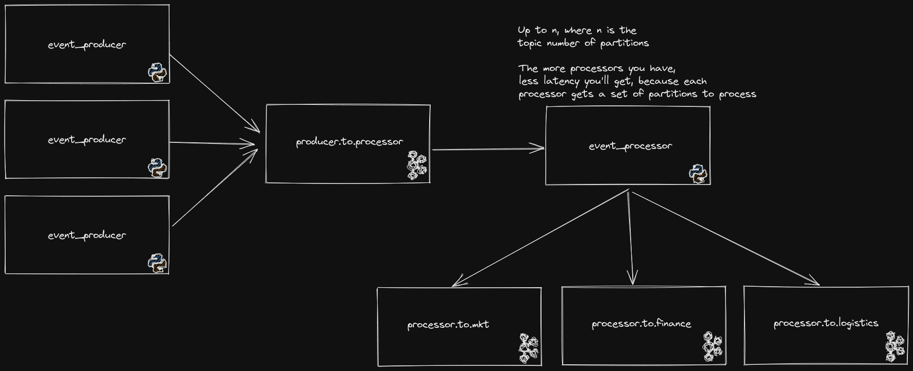

## Event Processor
An implementation of a challenge that requires a multi-tenant event processor.

## Considerations
- At least once delivery.
- Kafka will be the persistence layer.

## Technology Choices

- Python 3.9.2 just because I had it on my pyenv setup.
- Black as linter, just because its popularity. I had to go back a few versions in order to avoid dependency conflicts.
- landoop fast-data-dev docker image because it is an environment that I am used to play with on my studies.
- Kafka because it is a beautiful piece of technology, to be honest I struggled to don't go borderline and use
[this guy](https://redpanda.com/). But since I have a strong background on Kafka, I chose it. 
- Avro Data because it is an Industry standard and Kafka deals very well with it. Also, almost all clients have support 
and it is well optimized in terms of sizing.
- Schema registry because of its nice integration with Kafka.

## Description

Since the proposal was to have multi tenant input and a kind of fan out to multiple services, kafka is a very good fit
for the solution. I've decided to use a single topic for input to the Event Processor, and multiple topics for output.

Having a single topic for input, I understood that it is kind of a requirement, although I strongly disagree if the 
produced events have different schemas. I've simplified here and made a single schema for every event_producer, but 
again, if the schemas were different, I would put in different topics.

The messages in this topic are keyed by an id of the producers. If there is just a few of event_producers, it may be
wise to change this key strategy, otherwise, we will end up having hot partitions in the `producer.to.processor` topic.
One thing that worth mentioning is that I didn't care much about the code in the producers since it is not the asset
being evaluated according to the challenge description.

All the topics in the solution have just 3 partitions, because I guess that evaluating the performance is not an issue
here. But if we were building a production app, there should be an evaluation on how many partitions each topic would 
have since partitions define the throughput that the platform can reach.

The `event_processor` is quite simple, it gets messages from the topic, resolving its schema and sends to the 
appropriate output topic. Schema Registry was used with AVRO since this combination is widely used in the industry and
have nice features such as Schema Evolution and low overhead on the payload, because it holds just the schema id. Also,
for the persistence layer, we've used Kafka itself. It is easy to add a long retention persistence component in this
architecture, it could be used a Sink Kafka Connect connector from Kafka to a blob storage (s3, Azure Blob Storage, GCS).

The output topics all have the same schema for simplicity reasons.

## Troubles

I had a trouble composing a schema with two avro schemas. It seems that this was 
[a thing](https://github.com/confluentinc/schema-registry/issues/1439) with the distro of the Confluent platform inside 
the environment I was using, so I opted to a simpler schema structure.

Also, making the docker-compose turned out to be a hard task. I wanted to trigger a container startup on termination of
another one (`condition: service_completed_successfully`), but this is available only in a version of the docker-compose
that is not in apt or snap. Then, I chose to put a Sleep in the producers and consumers startup. I know this is bad, but
it is better than you having to set up a docker-compose version by hand.

## Improvements

There's a lot, but I wanted to deliver this on one week. The first thing is I would refactor the code and inject 
dependencies in both Producer and Consumer boilerplates to avoid having to patch so many stuff in tests.

Another thing that could be improved is the base docker images. I would use an Alpine or Slim distro installing stuff
that is required, but opted to simplify this and use a bigger, more complete, image to avoid headaches.

The other point of improvement that I see is that the event_processor could be replaced by a Kafka Streams app. 
Considering that you want to have a low latency in the platform, Java or Scala are more performant than Python. I know
that one of the goals of the test was to evaluate my coding skills in Python, but hey, I can't see a platform that have
an improvement screaming and don't talk about it.

> Talk about serialization errors